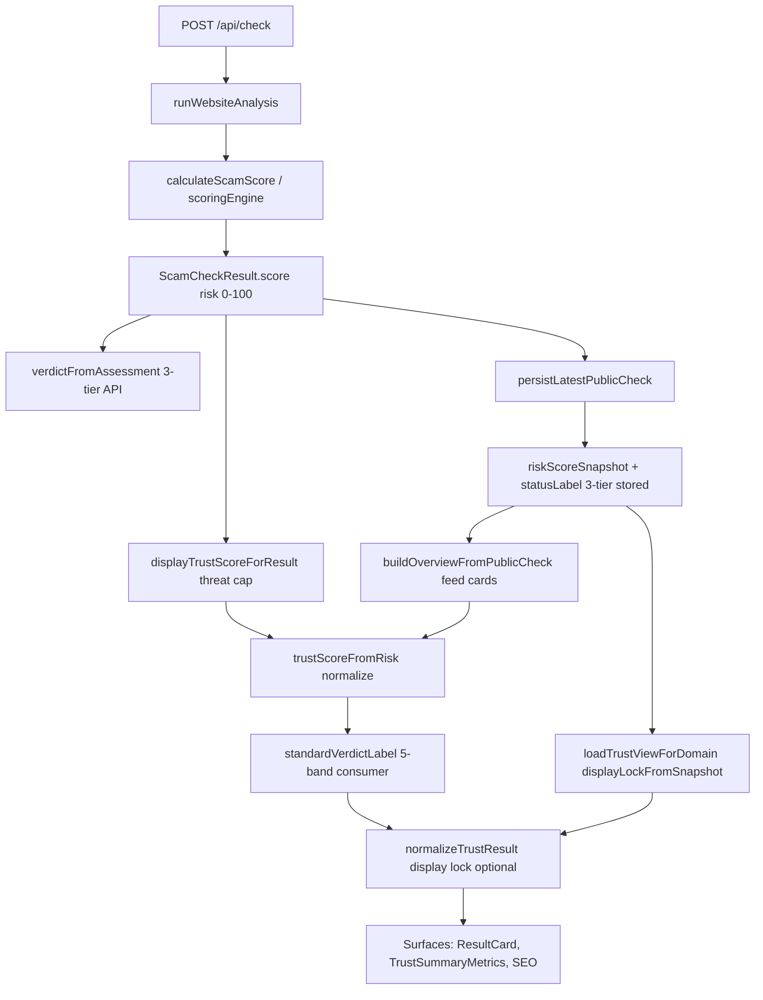

# Fraudly Trust Score Audit

**Date:** 2026-05-16  
**Scope:** End-to-end scoring integrity across API, normalization, snapshots, feeds, and UI.  
**Status:** Phase 1 critical fixes applied; Phases 2–4 tracked below.

---

## 1. Scoring flow (canonical path)



**Single source of truth (target):**

| Layer | Module | Output |
|-------|--------|--------|
| Risk | `lib/scoringEngine.ts` | `score` (0–100, higher = riskier) |
| Trust (display) | `lib/scoring/displayScore.ts` | `trustScoreFromRisk`, `standardVerdictLabel` |
| Threat cap | `lib/scanPresentation.ts` | `displayTrustScoreForResult` (max trust 20 when Tier‑1 intel) |
| Normalized view | `lib/trust/normalizeTrustResult.ts` | `NormalizedTrustResult` |
| Consumer chrome | `lib/scoring/trust-bands.ts` | colors, feed cards, `getTrustPresentation` |

---

## 2. Inconsistencies found

| ID | Symptom | Surfaces | Root cause |
|----|---------|----------|------------|
| I1 | Feed card “Safe” vs detail “Use Caution” for same scan | Latest checks vs `/check` | `buildOverviewFromPublicCheck` used 3-tier `statusLabel` for `humanKind`, not trust-derived 5-band label |
| I2 | `trustScoreFromRisk` differed | `trustSystem` vs `displayScore` | Duplicate impl; `trustSystem` did not normalize risk input |
| I3 | Recent search trust ≠ live result | Recent searches | `Math.round(100 - score)` skipped threat cap |
| I4 | Basic card trust drift | Basic tier UI | Raw `100 - score` without `normalizeRiskScore` |
| I5 | `?scanId=` ignored | `/check/[domain]` | Always loaded latest snapshot for domain |
| I6 | API `verdict: safe` vs UI “Use Caution” | API vs cards | `verdictFromAssessment` is 3-tier on risk; consumer uses 5 bands (e.g. trust 65) |
| I7 | `alignedDisplay` mixed verdict sources | Check page | `humanKind` used snapshot 3-tier `verdict`, label from normalized 5-band |
| I8 | Stale signals on public check page | `/check` | `getCachedWebsiteAnalysis` (1h) for signals; scores locked to snapshot |
| I9 | `publicResultPayload` unused | Snapshot row | Stored but check page does not hydrate from it |
| I10 | `statusLabel` vs `label` on snapshot | DB / display | Persist writes 3-tier label; `display.label` is 5-band from risk only |

---

## 3. Root causes

1. **Two verdict vocabularies** — API `ScamVerdict` (safe/suspicious/scam) vs consumer `ConsumerVerdictLabel` (5 bands). Mapped independently in several places.
2. **Risk vs trust confusion** — Some paths treated trust as input to `trustScoreFromRisk` or used `100 - score` without normalization/clamp.
3. **Snapshot label reuse for UX bucketing** — Feed overview derived `humanKind` from persisted 3-tier `statusLabel` instead of trust score.
4. **Threat cap not applied everywhere** — Only `displayTrustScoreForResult` / `normalizeTrustResult` applied Tier‑1 cap consistently.
5. **Cache layering** — Public pages blend long-lived analysis cache with snapshot display lock without merging `publicResultPayload`.

---

## 4. Risk areas

- **Score drift** between rescans when enrichment APIs flap (reviews, RDAP, feeds).
- **Duplicate penalties** if heuristics and feed signals stack without deduping in `scoringEngine`.
- **Display lock staleness** — New live scan does not update public snapshot until persist path runs.
- **Basic vs full scan** — Public cron uses `basic`; live API may run full analysis with different signals.
- **Mobile** — No separate app repo in monorepo; clients must consume `NormalizedTrustResult` fields, not re-derive trust.

---

## 5. False positive risks

| Signal | Risk |
|--------|------|
| Young domain / RDAP missing | “0 days” or unknown age → caution band |
| Risky TLD heuristics | Legit startups on `.xyz` etc. |
| Phishing keywords in benign copy | Lexical rules on page text |
| Failed review fetch | Must not invent low ratings (guarded in review resolvers; verify on changes) |
| SSL partial data | HTTPS without valid cert → caution |

---

## 6. False negative risks

| Signal | Risk |
|--------|------|
| Feed outage | No OpenPhish/URLHaus hit when feeds down |
| Basic scan only | Fewer signals on public snapshot path |
| Threat cap bypass | Any path using raw `100 - score` without `assessCriticalThreat` |
| Cached stale “safe” snapshot | Old row served while site turned malicious |

---

## 7. Cache risks

- `getCachedWebsiteAnalysis` — 1h TTL; signals can disagree with snapshot scores.
- `revalidate = 3600` on `/check/[domain]` — HTML cache may lag snapshot updates.
- Reputation / Outscraper caches — Stale review counts without UI “stale” indicator.
- Historical scan reuse — `preferredScanId` now honored; wrong id falls back to latest.

---

## 8. UX trust issues

- Verdict colors depended on Tailwind scanning `lib/` (fixed: `tailwind.config` includes `lib/**` + safelist).
- Feed cards need strong left border + headline hierarchy (addressed in `trust-bands.ts` feed tokens).
- Contradictory banners when threat active but headline still “Likely Safe” — `normalizeTrustResult` summary overrides when threat active.

---

## 9. Architecture issues

- Multiple entry points compute display trust (`trustSystem`, `displayScore`, inline `100-score`).
- `publicDisplayScoreFromLatestRow` still attaches 3-tier `verdict` from `statusLabel` while `label` is 5-band (field `verdict` is legacy).
- No persisted `consumerVerdictSnapshot` column — audit relies on risk + derivation.
- `scanResultDualLayer` bridges legacy `humanRecKind` to consumer bands — keep one mapping module (`consumerVerdictMap.ts`).

---

## 10. Recommended fix plan

### Phase 1 — Critical correctness (DONE)

- [x] Unify `trustScoreFromRisk` export via `displayScore.ts`
- [x] Feed overview: derive trust/verdict from risk only (`buildOverviewFromPublicCheck`)
- [x] `alignedDisplayFromSnapshot` uses `display.label` + consumer→legacy map
- [x] `/check?scanId=` → `resolveLatestPublicCheckSnapshotForCheckPage`
- [x] Recent search snap uses `displayTrustScoreForResult`
- [x] `BasicResultCard` uses `trustScoreFromRisk`
- [x] `lib/scoring/scoringIntegrity.ts` audit helper
- [x] `lib/scoring/consumerVerdictMap.ts` single legacy bridge

### Phase 2 — Normalization centralization (DONE)

- [x] `lib/trust/canonicalTrustBridge.ts` — legacy → normalized mapping + v2 `publicResultPayload`
- [x] API response: `trustScore`, `riskScore`, `consumerVerdict*`, `normalizedTrustResult`
- [x] Prisma columns + migration `20260516210000_latest_public_check_canonical_trust`
- [x] `loadTrustView` hydrates `storedNormalized` / `storedResult` from payload
- [x] `statusLabel` metadata-only for UX (feed uses `normalizedTrustScore` / `consumerVerdictLabel`)

### Phase 3 — UX consistency (DONE)

- [x] `lib/trust/dataConfidence.ts` + `TrustDataConfidenceBadge` on metrics + review cards
- [x] `lib/scoring/componentIntegrity.ts` dev warnings on conflicting props
- [x] ResultCard integrity logging when normalized trust provided

### Phase 4 — Performance + cache

- [ ] Invalidate analysis cache when new snapshot persisted
- [ ] Reduce `/check` ISR staleness or on-demand revalidate after scan
- [ ] Structured logging pipeline for `logDisplayScoreDebug` / `auditTrustDisplayAlignment`

---

## Canonical normalized schema (reference)

```ts
// lib/trust/types.ts — NormalizedTrustResult (excerpt)
{
  riskScore: number;           // 0-100 higher = riskier
  trustScore: number | null;   // display trust after cap + lock
  verdict: ConsumerVerdictLabel;
  scoreSource: "live_analysis" | "public_snapshot" | ...
  domainAge: { ageDays, display, verified, source }
  feeds: { status, matchedSources, display }
  // ... reviews, ssl, threat, confidence
}
```

**Rules:**

1. Never show trust without applying `displayTrustScoreForResult` when Tier‑1 threat fields exist.
2. Never map feed/card `humanKind` from `statusLabel` alone — use trust → `standardVerdictLabel` → `scamVerdictFromConsumerLabel`.
3. All colors from `getTrustPresentation(trustScore)` or `getOverviewFeedCardVisual`.

---

## Files touched (Phase 1)

- `lib/trustSystem.ts`
- `lib/overviewCardPresentation.ts`
- `lib/check/alignedDisplayFromSnapshot.ts`
- `lib/trust/loadTrustView.ts`
- `app/check/[domain]/page.tsx`
- `lib/recent-search/service.ts`
- `components/BasicResultCard.tsx`
- `lib/scoring/consumerVerdictMap.ts`
- `lib/scoring/scoringIntegrity.ts`
